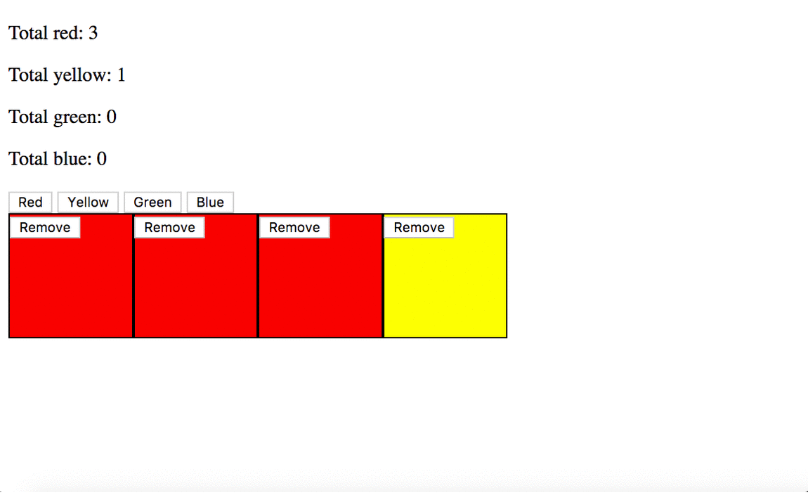

# jQuery Color Blocks
This Prime assignment tasked us with creating a script that appends colored blocks to the HTML display, and updates counters of total blocks. Blocks can be removed from the display.

# Technology used
jQuery, HTML, CSS. Focus on appending divs on button click, and adding classes to elements.